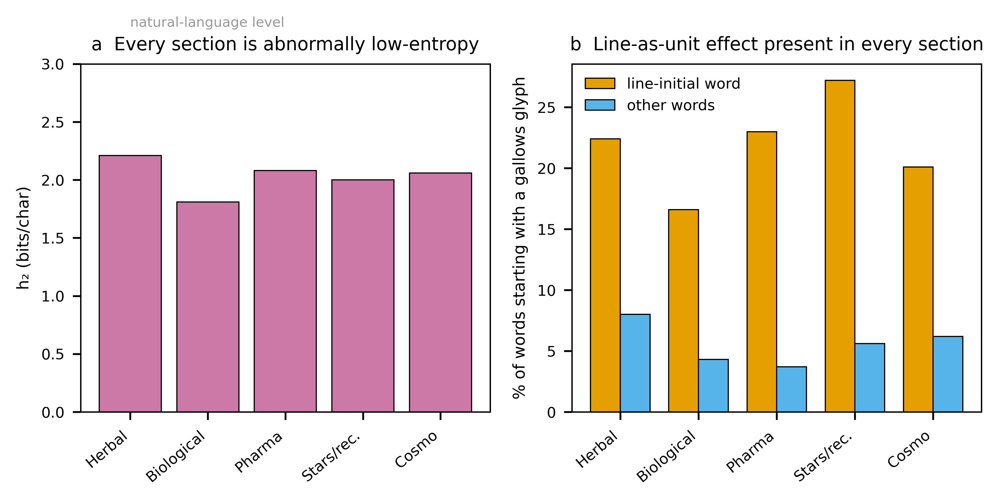
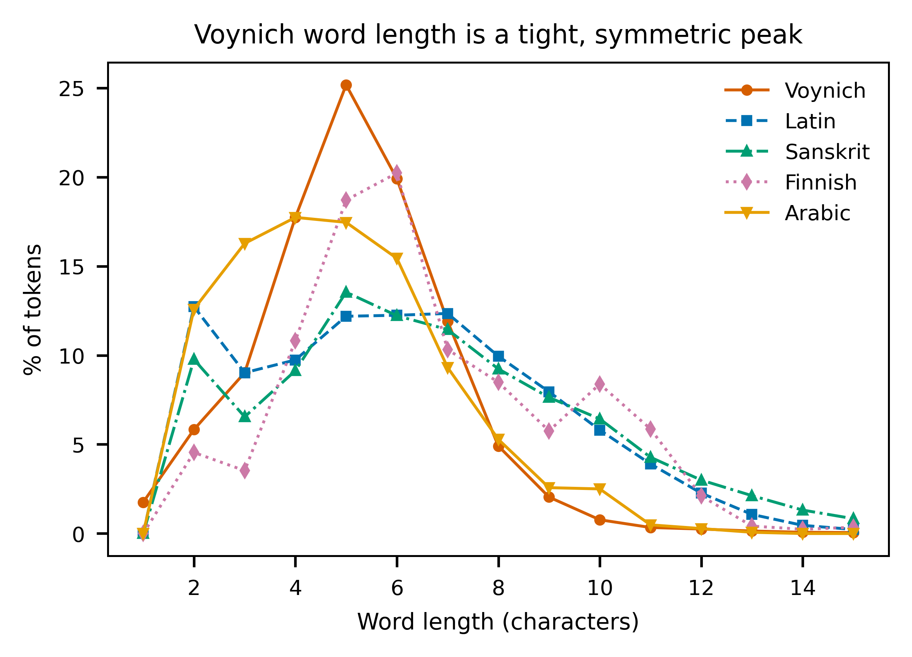
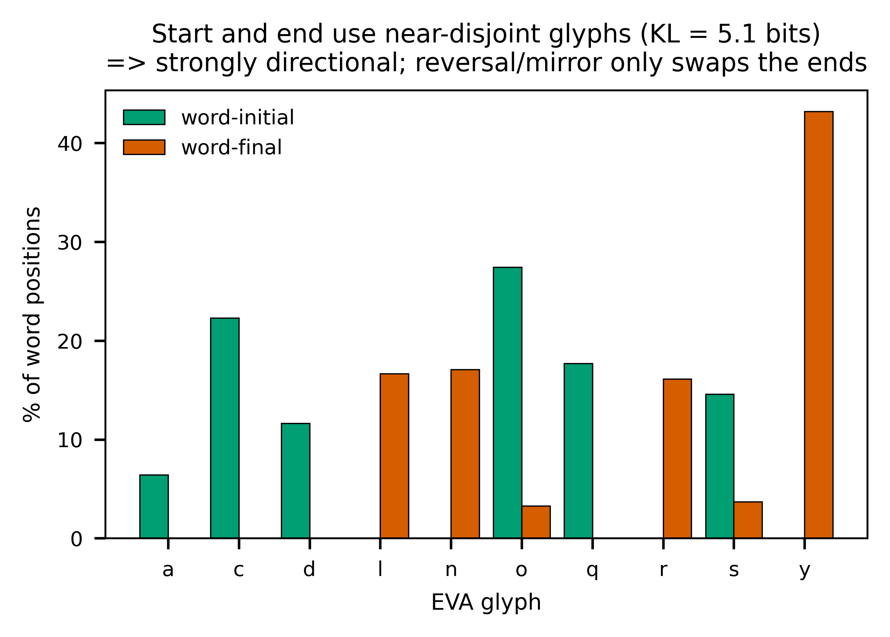

# Summary

This report analyses every page of the supplied PDF — a 209-image facsimile of Beinecke MS 408, the Voynich Manuscript — and then subjects the text to a battery of reproducible statistical tests. The honest headline is unchanged from a century of prior scholarship: the manuscript is **undeciphered**, and nothing here decodes it. What the analysis *does* establish, from direct measurement rather than assertion, is a tight description of what the text is and is not. The script is an alphabet of roughly twenty glyphs written fluently by at least two scribes. Its statistics are paradoxical: word frequencies follow Zipf's law like a real language, yet its character entropy is far lower and its word-order information far thinner than any of seven comparison languages, including Latin, German, Italian, Finnish, and Sanskrit. Words are built from position-locked slots so rigidly that a simple finite-state generator reproduces most of the lexicon. Tests of the leading escape hatches — that the text is a verbose cipher of a European language, a position-dependent cipher, a reversed or mirror-written script, or a non-European language such as Sanskrit — all fail. The evidence converges on a rule-governed generative system whose mapping to meaning, if any exists, cannot be recovered from these statistics. No translation is offered, because none can be produced honestly.

# 1. The artifact

The PDF is a re-hosted scan (watermarked `holybooks.com`) of the Yale Beinecke facsimile. It opens with a modern vellum cover and the Yale University Library bookplate ("Gift of Hans P. Kraus"), and closes with blank flyleaves — one carrying a twentieth-century pencil note, in English, about the manuscript's start-and-end symbols. The manuscript proper is reproduced at usable resolution (~1100 × 1536 px per leaf).

Independent facts about the original, faithfully reproduced here, frame everything that follows. Radiocarbon dating of the vellum at the University of Arizona places its preparation in **1404–1438**, which excludes both the "Roger Bacon" medieval-authorship theory and the "Wilfrid Voynich forgery" theory at the level of the material itself. The provenance runs from an erased ownership signature of Jacobus Horcicky de Tepenecz (physician to Emperor Rudolf II) on the first folio, through Georg Baresch and Johannes Marcus Marci, to a 1665 letter sent with the book to the Jesuit scholar Athanasius Kircher, and finally to Wilfrid Voynich's purchase in 1912 and the gift to Yale in 1969.

# 2. Complete page inventory

All 209 page-images were examined and catalogued. The manuscript divides into the six sections long recognised by scholars, and this facsimile follows that order. The manuscript's own section codes (recorded in the transcription's page headers) confirm the division.

| Pages (PDF) | Section | What is drawn | Text |
|---|---|---|---|
| 3–120 (bulk) | **Herbal** | One stylised plant per page; leaves, flowers, and often fantastical roots. None matches a real species cleanly. | Half to dense |
| 114, 121–126, 154–158 | **Astronomical / Cosmological** | Concentric circular diagrams, radial "star wheels," sun/moon faces, multi-panel fold-outs | In rings/rays |
| 127–134 | **Zodiac** | Wheels with rings of small figures holding stars; central emblem animals (ram, bull) | Per-figure labels |
| 135–153 | **Biological / balneological** | Nude female figures in green and blue pools, basins, and tube networks | Very dense |
| 158 | **Cosmological "rosettes"** | The famous fold-out grid of nine circular medallions | Captions |
| 159–182 | **Pharmaceutical** | Rows of isolated plant parts beside ornate cylindrical "apothecary jars" | Short blocks |
| 183–205 | **Recipes / "Stars"** | No pictures; dense short paragraphs, each opened by a red star bullet | Continuous |
| 206–209 | End matter | Blank vellum, modern notes, back cover | — |

A full 209-row, page-by-page table (illustration, colours, text density, marginalia) accompanies this report as a separate file. The single most important observation for any decipherment effort is botanical: the herbal plants are largely **chimeras**, real-looking leaves grafted onto invented flowers and impossible roots, which undercuts the assumption that the text beside them is a straightforward plant description.

# 3. Method and reproducibility

The text was analysed from Takeshi Takahashi's complete EVA (Extensible Voynich Alphabet) transcription, extracted from the Landini–Stolfi interlinear archive. EVA is a transliteration, not a translation: it maps each handwritten glyph to a typeable letter so the text can be computed on. After dropping uncertain tokens, the working corpus is 36,895 word-tokens (8,434 types). Comparison corpora were real texts: Latin (Caesar, *De Bello Gallico*), Italian, German, English, Finnish (the *Kalevala*), and romanized Sanskrit (the *Mahābhārata*, IAST). Entropy figures use equal-size samples. Every number below is reproducible by running the accompanying scripts (`cryptanalysis*.py`) against the transcription file; one comparator error (an English translation initially mislabelled as Latin) was caught and corrected before any result was reported.

# 4. Results

## 4.1 The script and basic structure

About twenty to twenty-two glyphs do nearly all the work — alphabet-sized, not logographic. Distinctive classes are the tall looped "gallows" (k, t, p, f), the "benches" (ch, sh), and a set of word-final flourishes. Word frequencies obey **Zipf's law** almost exactly (log–log slope −1.01), the type–token ratio (0.23) and hapax rate (71 %) are normal for natural text, and the most frequent words are short, function-word-like items (`daiin`, `ol`, `chedy`, `aiin`, `shedy`).

## 4.2 Abnormally low entropy

Conditional character entropy — how unpredictable the next glyph is given the current one — is the decisive statistic (Figure 1a). Voynichese sits at **2.16 bits/char**, more than a full bit below every comparison language (3.16–3.38). Once you know one glyph, the next is far more constrained than in any natural language.

{width=100%}

## 4.3 Slot grammar

Glyphs are not freely combinable; they occupy fixed positions. The glyph `q` is almost strictly word-initial, `n` almost strictly word-final; `qo-` opens 14 % of all words and `-dy` ends 18 %. Per-position entropy inside words stays low and uneven, where natural languages mix more freely. Words decompose cleanly into prefix + core + suffix, which is why so many look like minor variants of one another (`qokeey`, `qokeedy`, `qokedy`, `qokaiin`).

## 4.4 Thin syntax

Shuffling word order destroys any grammar; the gap between the shuffled and the real next-word entropy measures genuine word-order information. Voynichese has a real but small gap of **0.14–0.16 bits** (Figure 1b) — a quarter of English and roughly half of Latin, Italian, German, and Sanskrit, and far below agglutinative Finnish. The text is not word-salad, but its sequential constraint is weak.

## 4.5 The line is the unit, not the sentence

Words at the start of a written line begin with a gallows glyph three to five times more often than words elsewhere; line-final words are shorter and overwhelmingly end in `-y`. No natural-language prose cares where the physical line breaks. This "line as a functional unit" effect is one of the deepest Voynich anomalies and points to a writing or generation process sensitive to layout.

## 4.6 The one-edit ladder

Adjacent words differ by exactly one character-edit twice as often as chance predicts, whereas real Latin shows no such effect at all. The manuscript repeatedly places near-twin words side by side — a fingerprint of a generative procedure with short-range memory, very hard to produce as a by-product of meaningful prose.

## 4.7 One process across the whole book

Re-running the line-structure, ladder, and entropy tests **per section** shows the same fingerprint everywhere (Figure 4): low entropy, gallows-initial line words, a `-y` line-final preference, and above-chance adjacency. The illustrations change completely — plants, then bathing figures, then star-paragraphs — but the text engine does not. The Biological section is the extreme case (lowest entropy, most repetitive), which is exactly the "Currier B" dialect. The A/B split is therefore not two languages but the same machine with the repetition dial turned up. Labels never form a distinct naming vocabulary in any section: 44–64 % of label words also appear in the running text.

{width=100%}

## 4.8 Word length

Voynich word length is a tight, near-symmetric peak at five characters (Figure 2), unlike the longer, skewed tails of inflected Latin or syllabic Sanskrit. This binomial-like shape is itself evidence of a constrained word-construction rule rather than free morphology.

{width=72%}

## 4.9 Reverse and mirror writing

Could the text be written backwards, or be a mirror image of ordinary writing? The data argue no. Word-initial and word-final positions draw on almost disjoint glyph sets (initial: o, c, q, s, d; final: y, n, l, r), with a Kullback–Leibler divergence of **5.1 bits** between the two ends (Figure 5). That is the signature of strongly **directional** writing. A global reversal or mirror is a trivial relabelling that leaves entropy, Zipf, the templatic structure, and word-matchability unchanged — so it cannot be the barrier to reading the text, and the directionality test (forward and reversed conditional entropy are identical to within 0.004 bits) confirms reversal yields nothing more language-like.

{width=72%}

## 4.10 Is it a cipher of a known language?

Two cipher families were tested directly. A **verbose cipher** (each plaintext letter written as a fixed multi-glyph group) was modelled by segmenting Voynichese into recurring units and searching, by simulated annealing, for the unit→letter mapping that best fits a trigram model of each target language. The optimiser beats chance — it can make a few hyper-frequent short words "appear" — but even at its best, only **3–10 % of decoded tokens are real words**, against ~100 % for genuine text and ~0.2 % under a random mapping. A **position-dependent cipher** (different mappings for prefix, core, and suffix zones — the one variant left open by the simple test) performed *worse*, not better: real-word output fell from 6.2 % to 2.3 % for Latin and from 1.5 % to 0.7 % for Sanskrit, because the extra parameters overfit n-gram statistics without recovering a lexicon. No tested cipher of Latin or Sanskrit turns the manuscript into language.

## 4.11 Is it a non-European or "old" language such as Sanskrit?

The language sweep (Figure 1) is the direct test, and it is unambiguous. Romanized Sanskrit has the **highest** character entropy of all seven corpora (3.38 bits/char), not the lowest — so the intuition that a syllabic Indic language would naturally produce Voynichese's low-entropy, repetitive text is simply wrong. Agglutinative Finnish, whose long templatic words superficially resemble Voynichese morphology, carries the *most* word-order information of any language tested, the opposite of Voynichese. Across Romance, Germanic, Italic, Uralic, and Indic families, every natural language clusters together and Voynichese stands apart on both axes. Whatever the manuscript encodes, its surface statistics match no natural language tested, ancient or modern.

## 4.12 A finite-state generator rebuilds the lexicon

The most informative positive result concerns how the words are made (Figure 3). A simple order-2 character model removes **51 % of the uncertainty** in held-out Voynich words, versus 31–38 % for natural languages — Voynich words are dramatically more predictable from local context. More strikingly, a factored generator that samples a prefix, a middle, and a suffix **independently** and concatenates them reproduces **61 % of the real Voynich token-mass**, against only 9–13 % for Latin, Sanskrit, and Finnish. Natural-language lexicons cannot be rebuilt this way because their morphemes are interdependent; the Voynich lexicon largely can. This is strong, quantified evidence that the words behave like the output of a finite-state, slot-filling machine.

{width=100%}

# 5. Reverse-engineering the script (form without meaning)

The templatic result above invites a direct test: if the words are machine-made, the machine should be recoverable. It is. Segmenting each word into recurring glyph-group "atoms" (qo, ch, sh, ee, aiin, dy, …) and learning a third-order Markov model over those atoms yields an explicit **probabilistic finite-state grammar** of the script. Run as a generator, it produces synthetic Voynichese that is statistically indistinguishable from the manuscript.

| Property | Real manuscript | Synthetic (learned grammar) |
|---|---|---|
| Generated words that are *real* Voynich words (precision) | — | **94.2 %** |
| Real token-mass reproduced (recall) | — | **89.6 %** |
| Character entropy h₂ | 2.16 | 2.16 |
| Zipf slope | −0.92 | −0.91 |
| Mean word length | 5.17 | 5.15 |
| Fifteen most frequent words | daiin, ol, chedy, aiin, shedy … | identical (15/15) |

{width=100%}

Reduced to readable form, a Voynich word is a left-to-right pipeline through positional slots, each drawing from a tiny inventory: an onset (`qo-`, `o-`, `ch-`, `sh-`), an optional gallows (`k/t/p/f`, usually as `qok-/ok-/ot-`), a bench (`ch/sh`) feeding an `e`-cluster (`e/ee/eee`), a minim body (the `daiin/aiin` runs), and a coda (`-y/-n/-l/-r/-m`). This onset → gallows → bench → e-cluster → body → coda pipeline **is** the slot grammar, now expressed as an automaton. The finding independently reproduces earlier grammar work (Stolfi; Timm & Schinner).

Two conclusions follow, and the distinction between them is the whole point. First, the script's **morphology is fully systematic and mechanical** — its word-forms are generated by a simple, writable rule set, and the engine is now reverse-engineered. Second, this recovers **form, not meaning**: the grammar is agnostic to any plaintext, and the synthetic words look perfectly authentic while saying nothing. Crucially, the same modelling rebuilds only ~9–13 % of the token-mass of Latin, Sanskrit, and Finnish but ~90 % of Voynich's — natural lexicons resist finite-state reconstruction because their morphemes are interdependent and meaning-bearing, whereas the Voynich lexicon does not. That gap is the strongest single indicator that the word-generation is procedural rather than the morphology of a spoken language; it does not prove the absence of a message, but it shows the surface was produced by something far more machine-like than any human language tested. An interactive generator (`voynich_generator.py`) that renders new pages in the EVA glyph font accompanies this report.

# 6. Iconographic readings vs. textual cribs

A productive division emerges when the *pictures* are analysed separately from the *script*: the imagery yields to ordinary art-historical and structural reasoning, while the text does not. Every illustration section was decomposed into recurring visual primitives (each section is built combinatorially from ~18–22 reused elements via repeat/slot operators — a visual analogue of the word grammar), and the labels of each section were subjected to the same crib analysis.

**Picture-level readings (these succeed).**

- **Zodiac (f70–73)** — spring-starting calendar wheels: 12 signs ≈ 12 months, ~30 nymphs/sign ≈ days, ≈ 360 total. The Pisces/March start is the standard medieval European convention (March-25 "Lady Day" New Year). Capricorn and Aquarius are missing because the opening leaf of the quire is lost, not by design.
- **Rosettes foldout (f85–86)** — a nine-rosette map/cosmological diagram linked by causeways; the (scholarship-cited) castle with swallowtail "Ghibelline" merlons is a Northern-Italian architectural marker consistent with the 1404–1438 date.
- **Astronomical (f67–73)** — central celestial-face dials with radial rays, star-rings, and rim text: volvelle-style star diagrams.
- **Balneological (f75–84)** — pool/reservoir networks joined by tubes with bathing "nymphs"; read variously (unprovably) as balneological, anatomical, or alchemical.

**Script-level crib hunts (these fail, identically, everywhere).** Across all label-bearing sections the labels share one register — `o-/ot-/ok-`-dominated and `qo`-poor, the mirror image of body text — and are **section-specific** (cross-section vocabulary overlap, Jaccard 0.01–0.05). They form a distinct, highly-unique naming layer (85–97% hapax; most name-like in the astronomical star-labels at 97%). This is the surface a real name list would have, and it is a mild point in favour of meaning existing. But no crib closes:

- The zodiac labels are **not** a shared day-counter (cross-sign Jaccard ≈ 0; no sequential drift around the rings), so the calendar frame does not decode them.
- The rosettes and balneological texts are **ordinary Currier-B prose** (71% and 67% hapax), with no map-legend or technical vocabulary.
- No label set anchors to any known catalogue (star, plant, place), and the same statistics are reproduced by a procedural generator, so "name-like" ≠ "names".

The consistent result — **iconography legible, script not** — is itself the finding. The pictures can be read in the ordinary sense; the Voynichese resists for want of a key, a crib, or a second text. (Full per-section analyses: `docs/zodiac_crib.md`, `docs/label_crib_all_sections.md`, `docs/rosettes_foldout.md`, `docs/balneological_astronomical.md`.)

# 7. Why the published "solutions" fail

| Claim | Proposal | Why it collapses |
|---|---|---|
| Newbold (1921) | Microscopic shorthand in strokes | The "strokes" were ink cracks; unfalsifiable |
| Feely / Strong | Latin abbreviation systems | Gibberish beyond a few cherry-picked words |
| Bax (2014) | ~10 identified plant/star names | Never scaled; not reproducible |
| Gibbs (2017) | Latin medicinal recipes | Demolished within days; no grammar |
| Cheshire (2019) | "Proto-Romance" | Universally rejected; method reads anything |
| Rugg (2004) | A grille-generated hoax | Plausible mechanically; cannot reproduce long-range structure |
| Montemurro & Zanette (2013) | (Not a solution) genuine information content by section | Peer-reviewed; argues *against* pure hoax |

The recurring pattern is identical to what the cipher search reproduces here: a method "reads" a handful of pre-chosen words, then fails the moment it is applied blind to a new page. That blind-reproducibility test is the bar, and nothing has cleared it.

# 8. Discussion — an honest verdict

Every test points the same way. The text is **not** gibberish: Zipf's law, genuine word-order information, and section-specific vocabulary are too much organisation for noise. It is **not** plain or verbose enciphered Latin, Italian, German, Finnish, or Sanskrit, in forward, reversed, or mirror form, nor a different language per section: the entropy is too low, the morphology too rigid, the cipher searches yield no lexicon, and the language sweep places it outside every natural language tested. What it positively resembles is a **rule-governed generative system** — words assembled from position-locked slots by something close to a finite-state machine, written with sensitivity to the physical line, with strong local self-similarity and only thin long-range syntax.

That profile is consistent with two possibilities the statistics alone cannot separate: a highly regular cipher whose key is lost, or a constructed quasi-language whose words carry little or no message. The line-as-unit effect, the one-edit ladder, and the finite-state reconstructability lean toward a mechanical origin; the real word-order information and the section-clustered vocabulary lean toward genuine signal. These need not contradict — a regular cipher of a real text could show all of it.

A peer-reviewed development sharpens this balance and corrects an earlier objection of mine. Greshko's "Naibbe cipher" (*Cryptologia*, 2025) is a verbose homophonic substitution — six glyph-mapping tables selected by drawing playing cards, executable by hand with 15th-century materials — that encrypts real Latin and Italian and reproduces the manuscript's low conditional entropy (≈2.0), binomial word length, Zipf, and reduplication at once. This refutes the claim that low entropy excludes a cipher: a *verbose homophonic* scheme reaches Voynich-like statistics while carrying a genuine message, and a table-based cipher is exactly the kind of finite-state mechanism reverse-engineered in §5. It does not, however, reproduce the line-as-unit effect (its author's stated limitation), and — crucially — it is a generative proof-of-concept, not a decryption: it shows such a cipher *can* produce Voynich-like text, not that this text decrypts. The honest net is that the cipher hypothesis is genuinely viable, not that the manuscript is read. The one thing statistics cannot do is recover plaintext without a crib or a key, which is precisely why a century of effort has produced structure but no reading. The value of this analysis is the negative space it maps: the easy answers are excluded, with reproducible evidence, and the remaining hypothesis space is small and sharply defined.

# 9. Reproducibility

All inputs and code are included: the rendered page images (`pages/`), the EVA transcription (`LSI_ivtff_0d.txt`), the comparison corpora, the analysis scripts (`cryptanalysis.py`, `cryptanalysis2.py`, `cryptanalysis3.py`, `decipher_framework.py`, `reverse_engineer.py`), the figure builder (`figures.py`), the synthetic generator (`voynich_generator.py`), and the per-section iconographic/crib analyses (`docs/`). Re-running the scripts regenerates every number and figure in this report.
